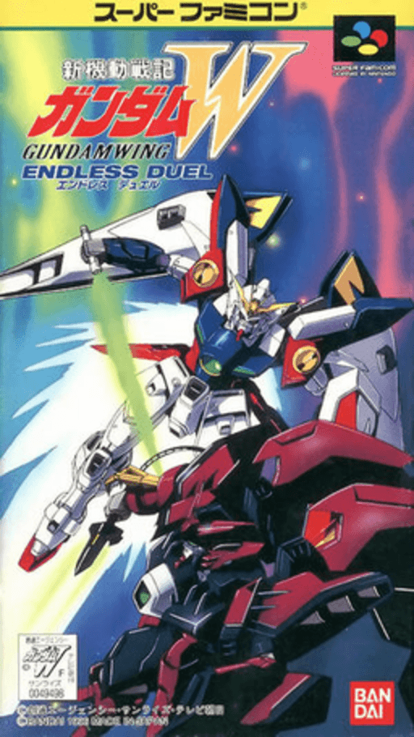

# Gundam Wing Endless Duel Recomp

<!-- retcomm-readme-metrics -->
[](https://github.com/TechnicallyComputers/GundamWingEndlessDuelSNESRecomp/releases)
[](https://github.com/TechnicallyComputers/GundamWingEndlessDuelSNESRecomp/releases/latest)
[](https://github.com/TechnicallyComputers/GundamWingEndlessDuelSNESRecomp/releases/latest)
<!-- /retcomm-readme-metrics -->

<!-- retcomm-readme-boxart -->
<p align="center">
  
</p>
<!-- /retcomm-readme-boxart -->

A native recompilation of **Gundam Wing Endless Duel** (JPN), built on
[snesrecomp](https://github.com/mstan/snesrecomp).

It is the year After Colony 195, and war between the Space Colonies and Earth has begun. To give the colonies an edge, they send 5 young soldiers, trained to perfection, to earth in the most powerful of Mobile Suits-Gundams. With their arrival, the tide of the war changes as they battle against the Earth forces and the Colonies of their origin.

> **You must legally own a copy of the game.** No ROM data is distributed with
> this project, in the repository or in any release. The recompiled C is
> generated locally from your own copy and is never committed.

## Status

Scaffolded on 2026-08-26 — **not yet a working port.** The layout, build,
regeneration pipeline, CI, and packaging are wired up; the game does not run
until the host work in `src/game_rtl.c` is done. See
[Porting from here](#porting-from-here).

## ROM identity

| | |
|---|---|
| File | `Shin Kidou Senki Gundam W - Endless Duel (Japan).sfc` |
| Publisher | Bandai |
| Year | 1996 |
| Mapping | lorom |
| Region | JPN (Japan) |
| Coprocessor | none |
| CRC32 | `c0aecdca` |
| SHA-256 | `dd94308d822636c6ddf73c5e2644c84f2eb8fb4d9201150fc5f37d44d6f423f1` |

`tools/regen.sh` refuses to run against anything else, so a mismatched
revision fails immediately instead of producing subtly wrong output.

## Build

```sh
git submodule update --init --recursive
bash tools/regen.sh --rom /path/to/Shin Kidou Senki Gundam W - Endless Duel (Japan).sfc
cmake -S . -B build -DCMAKE_BUILD_TYPE=Release
cmake --build build -j
```

The ROM does not have to live in the repository — keeping it on your own
drive is the better habit, and `SNESRECOMP_ROM` sets the path once for a
shell. `tools/regen.sh` also finds `Shin Kidou Senki Gundam W - Endless Duel (Japan).sfc` at the repo root if you
prefer that; `.gitignore` blocks it from ever being committed either way.

`tools/regen.sh` verifies the ROM, generates `src/gen/*.c`, and re-syncs
`recomp/funcs.h`. Re-run it whenever you change anything under `recomp/`.

### Releases are setup packs

A release zip does not contain the game — nothing derived from the ROM ever
does. It contains a **setup host** (this executable built with
`-DSNESRECOMP_SETUP_HOST=ON`, i.e. without recompiled code), the recompiler,
and this source tree. On first run the launcher takes your ROM, generates,
rebuilds into `build/`, and relaunches into the real game. The build tools
(the retcomm `cmake-clang-v1` pack) are embedded in the zip, or downloaded
once per machine if you chose a lean pack.

To produce one locally:

```sh
cmake -S . -B build-setup -DCMAKE_BUILD_TYPE=Release -DSNESRECOMP_SETUP_HOST=ON
cmake --build build-setup -j
scripts/package_release.sh build-setup linux-x64 [--embed-toolchain]
```

`src/gen/` must be empty for that configure; the framework refuses to build a
"setup" host from a tree that has generated C. `.github/workflows/release.yml`
does the same for four platforms.

<!-- retcomm-readme-launcher -->
## RetComM Launcher

You can run this title **standalone** (release zip + the built-in recomp-ui
Generate & Build flow), or manage installs, updates, ROM/BIOS wiring, and queued
builds more intuitively with
**[RetComM Launcher](https://github.com/TechnicallyComputers/RetComM-Launcher)** —
the Retro Compilation Manager hub for self-compiling recomps.

[Downloads](https://github.com/TechnicallyComputers/RetComM-Launcher/releases) ·
[Full README & features](https://github.com/TechnicallyComputers/RetComM-Launcher#readme)

<p align="center">
  
</p>

<p align="center">
  
</p>

RetComM checks for updates, rebuilds with existing build data when possible,
shares the portable toolchain used by per-title launchers, and automates
BIOS/ROM/save plumbing so you are not stuck repeating each game’s wizard by hand.
<!-- /retcomm-readme-launcher -->

## Layout

| Path | What lives there |
|---|---|
| `recomp/` | Analysis input: `bank*.cfg`, `symbols.toml`, generated `funcs.h` |
| `src/` | Host code you own: `main.c`, `game_rtl.c`, `codegen_setup.c` |
| `src/gen/` | Generated C. Never committed — regenerate locally |
| `snesrecomp/` | Framework submodule (owns `lib/recomp-net`, `lib/retcomm-rbengine`) |
| `translations/` | Runtime localization tables and Endless Duel-specific source data |
| `docs/TRANSLATION_TILEMAP_REFERENCE.md` | Reference workflow for runtime translations, tilemaps, and visual QA |
| `docs/WIDESCREEN.md` | Opt-in 16:9 (342x224): architecture, P1-P16 status with measurements, validation harness |
| `tools/` | `regen.sh` — the ROM → C pipeline |
| `scripts/` | `package_release.sh` — player-facing zip |
| `framework_pins.txt` | Exact framework commits this project was scaffolded against |

## Porting from here

The scaffold stops where the game-specific work starts. In rough order:

1. **Make it boot.** `src/game_rtl.c` holds the frame driver. The generic
   LLE-first shape is there; a real title usually needs a frame boundary and
   NMI delivery that understand its own main loop. This is the bulk of the
   work.
2. **Name things.** Add entries to `recomp/symbols.toml` as you identify
   routines, then re-run `tools/regen.sh`. Set `emit = true` to promote one
   into ahead-of-time codegen; leave it false to keep it interpreted.
3. **Resolve dispatch misses.** After every run, deal with unresolved
   indirect targets before anything else — they are the reason a port
   diverges, and they are cheap to fix early.
4. **Never synthesise a result** to get past uncovered code, and never edit
   `src/gen/` by hand. Fix the config or the framework and regenerate.

## Multiplayer

Two players, one controller per port.

Netplay is built with rollback available (`SNES_NET_MODE=rollback`); delay-sync
remains the default. See `snesrecomp/docs/ROLLBACK.md`.

## License

This project's own source is under the license in `LICENSE`. The framework
carries its own terms — see `snesrecomp/LICENSE` and
`snesrecomp/THIRD_PARTY_ATTRIBUTION.md`. Neither covers the game data, which
is not distributed here.

<!-- retcomm-readme-raid -->
---

<p align="center">
  <sub><b>R.A.I.D. — Retro AI Development</b> · a Discord for AI-assisted retro reverse-engineering, decomp &amp; recomp</sub>
</p>

<p align="center">
  <a href="https://discord.gg/Ad9BwSzctP"></a>
</p>
<!-- /retcomm-readme-raid -->
